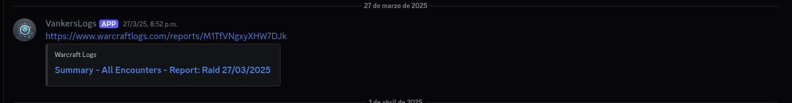

# WarcraftLogs Discord Bot

Este bot monitorea la API GraphQL de WarcraftLogs para detectar cuándo se genera un nuevo log de raid para una guild específica. Cuando detecta un nuevo reporte, lo publica automáticamente en un canal de Discord. Además, evita duplicados comparando el último mensaje enviado por el bot con el último reporte obtenido desde la API.
Ahora bien, ¿por qué surge la creación de este bot?
Este proyecto nace de la necesidad de obtener información actualizada sobre los logs de progreso de raids en World of Warcraft, lo cual es un factor relevante dentro de este entorno. En el momento en que fue desarrollado, el webhook oficial disponible había dejado de funcionar, por lo que se requería una solución alternativa que permitiera consultar esta información de forma periódica y automatizada.

## ¿Cómo funciona?

El flujo del bot es el siguiente:

1. Se autentica contra la API de WarcraftLogs usando OAuth2.
2. Consulta el último reporte disponible de la guild.
3. Obtiene el código del reporte.
4. Revisa el último mensaje enviado por el bot en Discord.
5. Compara ambos valores:
   - Si es el mismo → no hace nada.
   - Si es distinto → publica el nuevo link.
6. Espera 5 minutos y repite el proceso.

## Configuración

El código utiliza variables sensibles que deben ser configuradas manualmente antes de ejecutar el bot.

| Variable | Descripción |
|--------|-------------|
| TOKEN_BOT | Token del bot de Discord |
| CHANNEL_ID | ID del canal donde se publican los mensajes |
| CLIENT_ID | Client ID de WarcraftLogs |
| CLIENT_SECRET | Client Secret de WarcraftLogs |
| TOKEN_URL | Endpoint de autenticación OAuth |
| API_URL | Endpoint de la API GraphQL |
 ready
// Developer Profile
Cristian Gutiérrez
const role = "Software Engineer";
commits
1000+
projects
50+
coffee
∞

⚠️ **Importante:**  
Estos valores no están incluidos en el repositorio por motivos de seguridad.

## 🤝 Sobre este proyecto

Este bot nació más que nada por curiosidad y por querer facilitar un poco la vida dentro del contexto de WoW.
En su momento necesitaba una forma simple de ver los logs de raid sin depender de herramientas externas que ya no estaban funcionando (estoy hablando principio de 2025, puede ser que al momento que este leyendo esto ya hayan solucionado el problema, asi que puede ser que ya no sea necesario este bot, asi que tendría que evolucionar a algo más), así que decidí armar algo propio y aprovechar la API de WarcraftLogs.
Si a alguien le sirve como inspiración o base para algo más, feliz de que lo use.  
Siéntete libre de adaptarlo, mejorarlo o llevarlo a otro nivel.
Eso sí, considera que necesitas crear una cuenta en WarcraftLogs para obtener tus credenciales, y desde ahí mismo puedes explorar toda la documentación de su API GraphQL, que está bastante bien explicada y permite hacer consultas bien interesantes.
Si tienes dudas, ideas o simplemente quieres comentar algo, no dudes en escribir o abrir un issue o7
